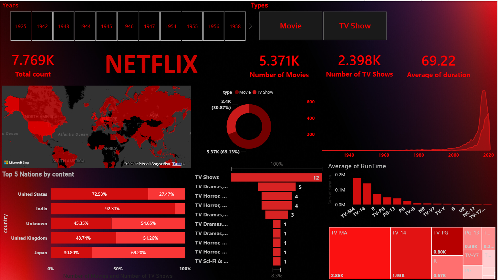

# Netflix Content Analysis Dashboard

## 📊 Project Overview

This project presents an interactive Netflix Content Analysis Dashboard developed using Microsoft Power BI.

The dashboard analyzes Netflix's content catalog to identify patterns and trends across Movies and TV Shows, release years, genres, ratings, countries, and content distribution.

The project demonstrates practical skills in data cleaning, data transformation, exploratory analysis, data visualization, and interactive dashboard development.

-----

## 🎯 Project Objectives
Analyze the distribution of Movies and TV Shows on Netflix
Identify content trends across different release years
Analyze Netflix content by country
Understand the distribution of ratings
Identify the most common genres
Compare Movies and TV Shows
Create an interactive dashboard for easy business-style analysis

----

## 🛠️ Tools & Technologies
Tool	Purpose
Microsoft Power BI	Interactive dashboard and data visualization
Power Query	Data cleaning and transformation
DAX	Measures and analytical calculations
CSV	Source dataset
Data Visualization	Charts, KPIs, slicers and interactive analysis

-----

## 📊 Dashboard Preview

-------

## 📌 Dashboard Features

The dashboard provides interactive analysis of:

🎬 Movies vs TV Shows
📅 Content by Release Year
🌎 Content by Country
⭐ Content Ratings
🎭 Genre Distribution
⏱️ Movie Duration
📺 TV Show Seasons
📈 Content Trends
🔎 Interactive filters and slicers
🔍 Key Analysis Areas
Movies vs TV Shows

----

## 🚀 How to Open

1. Download the `.pbix` file.
2. Open it using Microsoft Power BI Desktop.
3. Explore the dashboard using the interactive filters.

---

## 👤 Author

**Sagar Deekonda**
